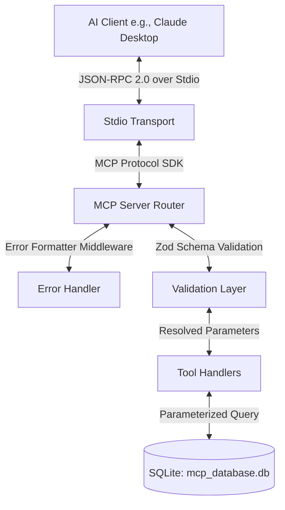

# Type-safe Model Context Protocol (MCP) SQLite Bridge

[](https://www.typescriptlang.org/)
[](https://nodejs.org/)
[](https://vitest.dev/)
[](https://github.com/aj-jhaveri/mcp-sqlite-bridge/actions/workflows/ci.yml)
[](LICENSE)

A clean, modular Model Context Protocol (MCP) server that enables AI agents to securely interact with local SQLite databases through type-safe, validated tools. Built with TypeScript, Zod, and Vitest, this server demonstrates modern AI engineering patterns, including agent-friendly error feedback loops and runtime safety controls.

---

## Why MCP Matters

Large Language Models (LLMs) are powerful reasoners but lack access to dynamic, real-time private data. The **Model Context Protocol (MCP)**, open-sourced by Anthropic, establishes a standardized bilateral protocol enabling AI agents to interact with data sources, local filesystems, and developer environments. 

Rather than engineering monolithic API integrations for every custom application, developers expose resources and tools via MCP. Standardized clients (such as Claude Desktop) instantly discover these tools, enabling agents to retrieve context, call functions, and inspect system environments dynamically, safely, and locally.

---

## Architecture

This project implements a modular, layered architecture to decouple transport protocols, parameter validations, and SQL transaction executions.



### Request Flow
1. **AI Client:** Issues a `tools/call` RPC command over standard input (`stdin`).
2. **MCP Protocol Layer:** Decodes the JSON-RPC payload and routes the parameters to the registered tool schema.
3. **Validation Layer:** Evaluates the parameters against strict Zod definitions. 
4. **Error Interceptor:** If validation fails, custom middleware interceptor cleans and compiles Zod issues into flat, readable error strings.
5. **Tool Handlers:** Receives validated TypeScript objects, executes parameterized queries against SQLite, and packages data into the standard MCP payload format.
6. **SQLite Driver:** Fetches records or commits updates to the database safely, keeping operations isolated.

---

## Available Tools

The server exposes the following tools depending on the current permission scope configuration:

| Tool Name | Operation | Parameters | Description |
| :--- | :--- | :--- | :--- |
| `query_data_source` | **Read** | `category: string` | Retrieves records matching the requested category/domain (e.g. `headcount`, `internal_metrics`). |
| `add_database_record` | **Create** | `category`, `key_name`, `status`, `detail_one?`, `detail_two?` | Inserts a new record into the database table. *(Disabled in read-only mode)* |
| `update_database_record` | **Update** | `id`, `category?`, `key_name?`, `status?`, `detail_one?`, `detail_two?` | Modifies an existing database row by its unique ID. *(Disabled in read-only mode)* |

---

## Agent Feedback Loop (Self-Correction)

Standard tool schemas often return raw Zod schema validation errors containing complex JSON arrays. When sent to an AI agent, this raw format causes confusion and increases conversational drift.

This server intercepts validation errors and formats them into clean, human-readable strings:

```text
Input validation error: Field 'category': expected string, received number; Field 'status': expected string, received undefined
```

When the LLM client receives this feedback, it identifies exactly which fields were invalid or missing and automatically corrects them in the subsequent turn without requiring user intervention.

---

## Security Model

Security is paramount when exposing data stores to autonomous agent operations:

1. **SQL Injection Prevention:** Every query in the handlers is fully parameterized. Handlers bind raw client values strictly using SQLite parameter bindings (`?`), preventing malicious payloads from altering the SQL statement structure.
2. **Access Control (READ_ONLY Mode):** The server supports a configurable read-only safety boundary. When enabled, mutation tools (`add_database_record`, `update_database_record`) are not registered or exposed.
3. **Local Sovereignty:** By operating entirely over `StdioServerTransport` on the local loop, the server prevents remote data leaks and respects host permission boundaries.

---

## Development

### 1. Installation
Install dependencies:
```bash
npm install
```

### 2. Configuration
Configure your database path and permissions in a local `.env` file:
```env
DB_PATH=mcp_database.db
READ_ONLY=false
```

### 3. Build & Run
Compile TypeScript sources to JavaScript:
```bash
npm run build
```

Run a standalone demo demonstrating tool querying, adding, and updating programmatically:
```bash
npm run demo
```

### 4. Integration with Claude Desktop
Add this server configuration to your `claude_desktop_config.json` (located at `~/Library/Application Support/Claude/claude_desktop_config.json` on macOS):

*(Note: Use absolute paths to `npx` and your project directory).*

```json
{
  "mcpServers": {
    "slake-data-tools": {
      "command": "npx",
      "args": [
        "tsx",
        "/absolute/path/to/mcp-server/src/server.ts"
      ]
    }
  }
}
```

### 5. Running Tests
Run the comprehensive Vitest test suite, validating CRUD operations, Zod formatting, security boundaries, and SQL injection sanitization:
```bash
npm test
```

---

## Extending the Server

To expose a new table or database action:

1. **Define Types:** Update [src/types/database.ts](file:///Users/aj/mcp-server/src/types/database.ts) to define records and tool configurations.
2. **Zod Validation:** Add a corresponding schema definition in [src/tools/schemas.ts](file:///Users/aj/mcp-server/src/tools/schemas.ts).
3. **Database Handler:** Write your database transaction function in [src/tools/handlers.ts](file:///Users/aj/mcp-server/src/tools/handlers.ts) utilizing parameterized queries.
4. **Register:** Connect the handler to the server in [src/tools/index.ts](file:///Users/aj/mcp-server/src/tools/index.ts).

---

## Roadmap

Future improvements targeting enterprise agent environments:
* **Multi-database Driver Interface:** Support PostgreSQL and MySQL drivers through a common database abstract factory pattern.
* **Granular Role-Based Access Control:** Fine-grained API-key permissions or role scopes mapping client sessions to distinct table boundaries.
* **Transaction Confirmations:** A secure webhook callback system allowing human-in-the-loop validation before committing high-value database modifications.
* **Observability Interceptors:** OpenTelemetry tracing support to track tool call durations, error rates, and system resource metrics.