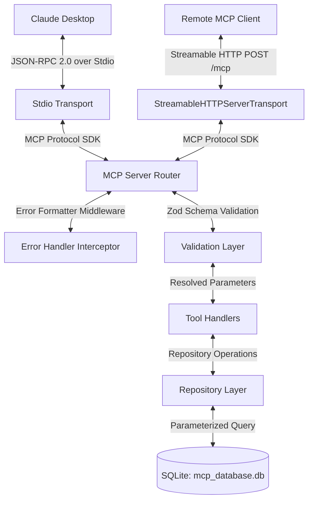

# Type-safe Model Context Protocol (MCP) SQLite Bridge

[](https://www.typescriptlang.org/)
[](https://nodejs.org/)
[](https://vitest.dev/)
[](https://github.com/aj-jhaveri/mcp-sqlite-bridge/actions/workflows/ci.yml)
[](LICENSE)

A clean, modular Model Context Protocol (MCP) server that gives AI agents read-only access to local or remote SQLite databases by default, through type-safe, validated tools over both the **Stdio** and **Streamable HTTP** MCP transports. Any compliant MCP client — Claude Desktop over stdio, or an SDK client over HTTP — can connect, discover the tools, and call them.

**Live Web Demo:** [slakedesign.com/demo/mcp](https://slakedesign.com/demo/mcp)

---

## Why MCP Matters

Large Language Models (LLMs) are powerful reasoners but lack access to dynamic, real-time private data. The **Model Context Protocol (MCP)**, open-sourced by Anthropic, establishes a standardized bilateral protocol enabling AI agents to interact with data sources, local filesystems, and developer environments. 

Rather than engineering monolithic API integrations for every custom application, developers expose resources and tools via MCP. Standardized clients (such as Claude Desktop or remote web applications) instantly discover these tools, enabling agents to retrieve context, call functions, and inspect system environments dynamically, safely, and predictably.

---

## Architecture

This project implements a modular, layered architecture supporting both official MCP transports (`Stdio` for local desktop clients and `Streamable HTTP` for remote clients and cloud deployments):


```mermaid
graph TD
    Client1[Claude Desktop] <-->|JSON-RPC 2.0 over Stdio| StdioTransport[Stdio Transport]
    Client2[Remote MCP Client] <-->|Streamable HTTP POST /mcp| HttpTransport[StreamableHTTPServerTransport]
    
    StdioTransport <-->|MCP Protocol SDK| Server[MCP Server Router]
    HttpTransport <-->|MCP Protocol SDK| Server
    
    Server <-->|Error Formatter Middleware| Middleware[Error Handler Interceptor]
    Server <-->|Zod Schema Validation| Schemas[Validation Layer]
    Schemas <-->|Resolved Parameters| Handlers[Tool Handlers]
    Handlers <-->|Repository Operations| Repository[Repository Layer]
    Repository <-->|Parameterized Query| Database[(SQLite: mcp_database.db)]
```

### Dual Transport Support
- **Stdio Transport** (`STDIO=true`): Used by local desktop apps (Claude Desktop, Cursor) operating over `stdin`/`stdout`.
- **Streamable HTTP Transport** (`POST /mcp`): The official MCP HTTP transport, served by the SDK's `StreamableHTTPServerTransport`. Runs **stateless** — a fresh server and transport are constructed per request, since the deploy target is a single instance on an ephemeral filesystem with nowhere to keep session state.

Both transports are driven by the same tool registrations and the same read-only policy,
and both are exercised against a real SDK client in CI (`tests/mcp-protocol.test.ts`).

---

## Available Tools

The server exposes the following tools depending on the current permission scope configuration:

| Tool Name | Operation | Parameters | Description |
| :--- | :--- | :--- | :--- |
| `query_data_source` | **Read** | `category: string` | Retrieves records matching the requested category/domain (e.g. `headcount`, `internal_metrics`, `engineering_delivery`). |
| `add_database_record` | **Create** | `category`, `key_name`, `status`, `detail_one?`, `detail_two?` | Inserts a new record into the database table. *(Disabled in `READ_ONLY` mode)* |
| `update_database_record` | **Update** | `id`, `category?`, `key_name?`, `status?`, `detail_one?`, `detail_two?` | Modifies an existing database row by its unique ID. *(Disabled in `READ_ONLY` mode)* |

---

## Agent Feedback Loop (Self-Correction)

Standard tool schemas often return raw Zod schema validation errors containing complex JSON arrays. When sent to an AI agent, this raw format causes confusion and increases conversational drift.

This server intercepts validation errors and formats them into clean, human-readable strings:

```text
Input validation error: Field 'category': expected string, received number; Field 'status': expected string, received undefined
```

When the LLM client receives this feedback, it identifies exactly which fields were invalid or missing and automatically corrects them in the subsequent turn without requiring user intervention.

---

## Security Model

Security is paramount when exposing data stores to autonomous agent operations:

1. **SQL Injection Prevention:** Every query in the handlers is fully parameterized. Handlers bind raw client values strictly using SQLite parameter bindings (`?`), preventing malicious payloads from altering the SQL statement structure.
2. **Access Control (`READ_ONLY` Mode):** Read-only is the **default**, not an opt-in, and it is enforced in two independent places. Mutation tools (`add_database_record`, `update_database_record`) are neither registered nor advertised in `tools/list` (`src/tools/index.ts`, `registerTools`), so a direct `tools/call` is rejected by the SDK's dispatch layer before any handler runs — the observed response is `MCP error -32602: Tool add_database_record not found`. The tool does not exist on a read-only server rather than existing and refusing. As defence in depth, both mutation handlers re-check `config.readOnly` and refuse independently of how they were reached (`src/tools/handlers.ts`). Writes require setting `READ_ONLY=false` deliberately; any other value — unset, empty, or misspelled — resolves to read-only (`src/config/security.ts`, `resolveReadOnly`), so a missing environment variable cannot silently unlock the database. Verified by `tests/security.test.ts` and `tests/mcp-protocol.test.ts`.
3. **Cost controls on a public endpoint:** The HTTP transport is unauthenticated by design — any MCP client must be able to connect. Read-only means a caller cannot *change* anything; it does not mean a caller cannot *cost* anything, since every tool call reaches SQLite. `/mcp` is therefore bounded two ways: 60 requests/minute per IP, and 300/minute across all callers combined. Per-IP answers one flooder; the global ceiling answers many addresses each staying politely under it.
4. **Explicit CORS allowlist:** Browser access is restricted to `CORS_ALLOWED_ORIGINS` rather than `*`, so an arbitrary web page cannot drive this server using a visitor's browser. Requests without an `Origin` header — curl, uptime monitors, every non-browser MCP client — pass through untouched.
5. **Local Sovereignty & Transport Flexibility:** Operates over local `Stdio` or an HTTP endpoint. Do not set `READ_ONLY=false` on a publicly reachable instance.

---

## Connecting a Real MCP Client

The repo ships a working MCP client (`src/client/mcp-client.ts`) built on the official
SDK. Unlike a hand-written JSON-RPC POST, it performs the real initialize handshake and
capability negotiation, so it works against this server the same way it would against
any other MCP server.

```bash
npm run build

# stdio — launches dist/server.js as a subprocess, exactly as Claude Desktop does
npm run client

# Streamable HTTP — against a running server
npm start &
npm run client -- --http

# ...or a remote deployment
npm run client -- --http --url https://your-host.example.com/mcp

# query a different category
npm run client -- --category headcount
```

Expected output under the default (read-only) posture:

```text
Connected to slake-sqlite-tools v1.0.0

Tools advertised (1):
  - query_data_source: Retrieve metrics records from the SQLite database...

Write tools advertised: false
```

`tests/mcp-protocol.test.ts` drives this same client against both transports as an
integration test, so protocol compliance is verified in CI rather than assumed.

---

## Health Check

```bash
curl http://localhost:3000/health
# → {"status":"HEALTHY","timestamp":"...","service":"mcp-sqlite-bridge","readOnly":true}
```

`/health` is a plain operational endpoint, deliberately not an MCP call: asking whether
the service is up should not require a protocol handshake that would itself fail when
the answer is no. Every other interaction goes through `/mcp` — see the client section
above.

---

## Integration with Claude Desktop (Stdio)

To connect this MCP server to **Claude Desktop**, edit `claude_desktop_config.json` (located at `~/Library/Application Support/Claude/claude_desktop_config.json` on macOS):

```json
{
  "mcpServers": {
    "slake-data-tools": {
      "command": "node",
      "args": [
        "/absolute/path/to/mcp-server/dist/server.js"
      ],
      "env": {
        "STDIO": "true",
        "READ_ONLY": "false"
      }
    }
  }
}
```

**`"STDIO": "true"` is required.** Without it the process serves HTTP instead of the
stdio transport, so the client waits for a handshake that never arrives and reports
only `Connection closed`. The server now prints an explicit warning to stderr when it
detects this (piped stdin, `STDIO` unset), which the client surfaces in its logs.

`READ_ONLY: "false"` is a deliberate opt-in for **local stdio use**, where the only
client is your own agent and the database is a local file. Never set it on the hosted
HTTP deployment: that endpoint is unauthenticated and accepts all origins, so write
access there is write access for anyone who finds the URL. Omit it entirely to run the
local client read-only too.

In stdio mode the process does **not** bind a TCP port. HTTP remains the default, so
the deployed service needs no configuration.

---

## Development

### 1. Installation
```bash
npm install
```

### 2. Build & Typecheck
```bash
npm run build
```

### 3. Development Server
```bash
npm run dev
```

### 4. Automated Tests
Run the comprehensive Vitest test suite, validating CRUD operations, Zod formatting, security boundaries, and HTTP JSON-RPC 2.0 endpoints:
```bash
npm test
```

---

## Documentation & Architecture

* [System Architecture (`docs/architecture.md`)](docs/architecture.md)
* [Design Decisions & Engineering Tradeoffs (`docs/design_decisions.md`)](docs/design_decisions.md)