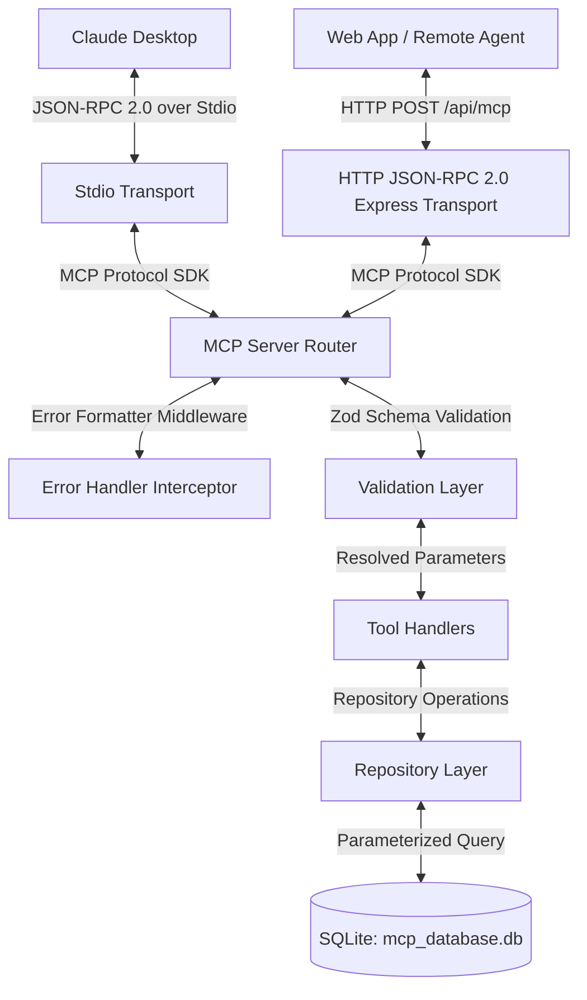

# Type-safe Model Context Protocol (MCP) SQLite Bridge

[](https://www.typescriptlang.org/)
[](https://nodejs.org/)
[](https://vitest.dev/)
[](https://github.com/aj-jhaveri/mcp-sqlite-bridge/actions/workflows/ci.yml)
[](LICENSE)

A clean, modular Model Context Protocol (MCP) server that enables AI agents to securely interact with local or remote SQLite databases through type-safe, validated tools over both **Stdio** and **HTTP / SSE JSON-RPC 2.0** transports.

**Live Web Demo:** [slakedesign.com/demo/mcp](https://slakedesign.com/demo/mcp)

---

## Why MCP Matters

Large Language Models (LLMs) are powerful reasoners but lack access to dynamic, real-time private data. The **Model Context Protocol (MCP)**, open-sourced by Anthropic, establishes a standardized bilateral protocol enabling AI agents to interact with data sources, local filesystems, and developer environments. 

Rather than engineering monolithic API integrations for every custom application, developers expose resources and tools via MCP. Standardized clients (such as Claude Desktop or remote web applications) instantly discover these tools, enabling agents to retrieve context, call functions, and inspect system environments dynamically, safely, and predictably.

---

## Architecture

This project implements a modular, layered architecture supporting dual transport layers (`Stdio` for local desktop clients and `HTTP JSON-RPC 2.0` for web applications and cloud deployments):


```mermaid
graph TD
    Client1[Claude Desktop] <-->|JSON-RPC 2.0 over Stdio| StdioTransport[Stdio Transport]
    Client2[Web App / Remote Agent] <-->|HTTP POST /api/mcp| HttpTransport[HTTP JSON-RPC 2.0 Express Transport]
    
    StdioTransport <-->|MCP Protocol SDK| Server[MCP Server Router]
    HttpTransport <-->|MCP Protocol SDK| Server
    
    Server <-->|Error Formatter Middleware| Middleware[Error Handler Interceptor]
    Server <-->|Zod Schema Validation| Schemas[Validation Layer]
    Schemas <-->|Resolved Parameters| Handlers[Tool Handlers]
    Handlers <-->|Repository Operations| Repository[Repository Layer]
    Repository <-->|Parameterized Query| Database[(SQLite: mcp_database.db)]
```

### Dual Transport Support
- **Stdio Transport**: Used by local desktop apps (Claude Desktop, Cursor) operating over `stdin`/`stdout`.
- **HTTP / SSE Transport**: Express server exposing `POST /api/mcp` and `GET /health` with full CORS support for browser clients and cloud deployments.

---

## Available Tools

The server exposes the following tools depending on the current permission scope configuration:

| Tool Name | Operation | Parameters | Description |
| :--- | :--- | :--- | :--- |
| `query_data_source` | **Read** | `category: string` | Retrieves records matching the requested category/domain (e.g. `headcount`, `internal_metrics`, `engineering_delivery`). |
| `add_database_record` | **Create** | `category`, `key_name`, `status`, `detail_one?`, `detail_two?` | Inserts a new record into the database table. *(Disabled in `READ_ONLY` mode)* |
| `update_database_record` | **Update** | `id`, `category?`, `key_name?`, `status?`, `detail_one?`, `detail_two?` | Modifies an existing database row by its unique ID. *(Disabled in `READ_ONLY` mode)* |

---

## Agent Feedback Loop (Self-Correction)

Standard tool schemas often return raw Zod schema validation errors containing complex JSON arrays. When sent to an AI agent, this raw format causes confusion and increases conversational drift.

This server intercepts validation errors and formats them into clean, human-readable strings:

```text
Input validation error: Field 'category': expected string, received number; Field 'status': expected string, received undefined
```

When the LLM client receives this feedback, it identifies exactly which fields were invalid or missing and automatically corrects them in the subsequent turn without requiring user intervention.

---

## Security Model

Security is paramount when exposing data stores to autonomous agent operations:

1. **SQL Injection Prevention:** Every query in the handlers is fully parameterized. Handlers bind raw client values strictly using SQLite parameter bindings (`?`), preventing malicious payloads from altering the SQL statement structure.
2. **Access Control (`READ_ONLY` Mode):** Read-only is the **default**, not an opt-in. Mutation tools (`add_database_record`, `update_database_record`) are neither registered nor advertised in `tools/list`, and calls to them return an explicit security payload (`MCP_SECURITY_VIOLATION`). Writes require setting `READ_ONLY=false` deliberately; any other value — unset, empty, or misspelled — resolves to read-only, so a missing environment variable cannot silently unlock the database.
3. **Local Sovereignty & Transport Flexibility:** Operates over local `Stdio` or an HTTP endpoint. Note that the HTTP transport is **unauthenticated and accepts all origins**; it is safe to expose publicly only because the read-only default removes write access. Do not set `READ_ONLY=false` on a publicly reachable instance.

---

## REST & HTTP API Usage (JSON-RPC 2.0)

### 1. Health Check
```bash
curl http://localhost:3000/health
# → {"status":"HEALTHY","timestamp":"...","service":"mcp-sqlite-bridge","readOnly":true}
```

### 2. List MCP Tools (`tools/list`)
```bash
curl -X POST http://localhost:3000/api/mcp \
  -H "Content-Type: application/json" \
  -d '{
    "jsonrpc": "2.0",
    "method": "tools/list",
    "id": 1
  }'
```

### 3. Call MCP Read Tool (`tools/call`)
```bash
curl -X POST http://localhost:3000/api/mcp \
  -H "Content-Type: application/json" \
  -d '{
    "jsonrpc": "2.0",
    "method": "tools/call",
    "params": {
      "name": "query_data_source",
      "arguments": { "category": "engineering_delivery" }
    },
    "id": 2
  }'
```

---

## Integration with Claude Desktop (Stdio)

To connect this MCP server to **Claude Desktop**, edit `claude_desktop_config.json` (located at `~/Library/Application Support/Claude/claude_desktop_config.json` on macOS):

```json
{
  "mcpServers": {
    "slake-data-tools": {
      "command": "node",
      "args": [
        "/absolute/path/to/mcp-server/dist/server.js"
      ],
      "env": {
        "STDIO": "true",
        "READ_ONLY": "false"
      }
    }
  }
}
```

`READ_ONLY: "false"` above is a deliberate opt-in for **local stdio use**, where the
only client is your own agent and the database is a local file. Never set it on the
hosted HTTP deployment: that endpoint is unauthenticated and accepts all origins, so
write access there is write access for anyone who finds the URL.

---

## Development

### 1. Installation
```bash
npm install
```

### 2. Build & Typecheck
```bash
npm run build
```

### 3. Development Server
```bash
npm run dev
```

### 4. Automated Tests
Run the comprehensive Vitest test suite, validating CRUD operations, Zod formatting, security boundaries, and HTTP JSON-RPC 2.0 endpoints:
```bash
npm test
```

---

## Documentation & Architecture

* [System Architecture (`docs/architecture.md`)](docs/architecture.md)
* [Design Decisions & Engineering Tradeoffs (`docs/design_decisions.md`)](docs/design_decisions.md)